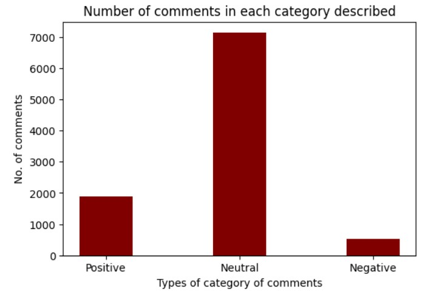

# YouTube_comment_sentiment_analysis

# Motivation
YouTube, the world’s second-largest search engine, is a massive hub of diverse content — from entertainment and education to lifestyle and beyond. One of the most valuable yet often overlooked parts of any video is its comment section. It reflects the audience’s sentiments, provides feedback for creators, and serves as a space for viewer interaction.

However, there's a growing challenge: the rising tide of spam comments. These not only clutter the conversation but also pose a serious threat, being a common source of scams and misinformation. For content creators, this makes it increasingly difficult to analyze genuine feedback and understand their audience’s needs.

Moreover, with large channels generating thousands of comments per video, manually analyzing them becomes nearly impossible. This is where automated comment analysis becomes essential — both for creators and viewers. While creators can use it to adapt their content and improve engagement, viewers benefit too: by skimming through top comments, they can quickly gauge the value and relevance of a video, especially in an age of clickbait titles and misleading thumbnails.

Additionally, since YouTube removed the public dislike counter, analyzing comment sentiment can serve as an alternative metric for audience reception — offering a clearer picture of whether a video is well-received or not.

# Problem Statement
Extract all the comments of a YouTube video and predict the Spam Comments using the Classification model trained on the spam comments dataset. Then perform a sentimental analysis and generate a Word Cloud to get the hot topics people are talking about after eliminating the spam comments and finding out the number of negative and positive comments to decide whether the content is liked by viewers or not.

# Algorithms & Tools used
- NLTK (Natural Language Toolkit)
- Sklearn, NumPy, Matplotlib, Pandas
- SVM (Support Vector Machine)
- Logistic Regression
- Text Analytics
- Word Cloud
- NLP (Natural Language Processing)
- Google API Client

# Dataset Used
- https://www.youtube.com/watch?v=kX3nB4PpJko for “comments_dataset.csv” extracted using API.

- https://www.kaggle.com/datasets/lakshmi25npathi/images for “Youtube01-Psy.csv”.

# Methodology
## Comment Extraction
The script comment_extractor.py is designed to automatically fetch all comments and replies from a YouTube video. To do this, you just need to provide the videoId of the video. The videoId is the part that comes after v= in a YouTube URL. For example, in https://www.youtube.com/watch?v=dQw4w9WgXcQ, the videoId is dQw4w9WgXcQ.
### How it works
The script uses the YouTube Data API v3, accessed via the Google API Client.
To use the API, you’ll need an API key. You can generate one by visiting: YouTube API – Get Started
### Script Logic
- he main() function in the script starts by calling the comment_threads(videoId) function.
- This function sends a request to the YouTube API, which returns up to 20 comments per request.
- These comments are processed using process_comments() to separate top-level comments from replies, and stored in a list called comments_list.
- Since the API can only return 20 comments at a time, a while loop is used to keep fetching until all comments and replies are retrieved.
- Once all data is collected, the make_csv() function saves everything into a file called comments_dataset.csv.
### How to run
In your terminal or command line, just run: python comment_extractor.py

# Spam Classification
To detect spam in YouTube comments, we trained a machine learning model using the ‘Youtube01-Psy’ dataset.
This dataset includes the following columns:
- COMMENT_ID
- AUTHOR
- CONTENT (the actual comment)
- CLASS — this tells us whether the comment is spam or not.
If CLASS = 1, the comment is spam. If CLASS = 0, it's not spam.
## Models Used:
We experimented with two models:
- Logistic Regression
- Support Vector Machine (SVM) with a Linear Kernel
The dataset was split into 80% training data and 20% test data.Here’s how the models performed:
- Logistic Regression: 78.57% accuracy
- SVM: 87.14% accuracy
Since SVM performed much better, we chose it for our final spam classification model.
## Applying the Model on New Data
We then used our trained SVM model on a new dataset named comments_dataset, which contains YouTube comments collected using our extraction script.
This dataset includes various fields such as:
- videoId, textDisplay, textOriginal, parentId
- authorDisplayName, authorProfileImageUrl, authorChannelUrl
- authorChannelId, canRate, viewerRating, likeCount
- publishedAt, updatedAt, commentId
Before classification, we removed unnecessary columns that were not relevant to spam detection.

## Classification Process
We ran our trained SVM model on the dataset.
A new column named spam was added to the dataset.
- spam = 1 → comment is spam
- spam = 0 → comment is not spam
This updated dataset was saved as comments_datasetwithspam.csv.
Finally, we filtered out all the spam comments and created a clean dataset containing only non-spam comments.
This dataset is named Non_Spam_Comments.csv.

# Sentimental Analysis
Sentiment analysis was performed on this dataset. Word Cloud was formed and displayed.

Text cleaning was performed like removing stop words, lemmatization, removing all the words having length less than 2, etc.,a list of updated stop words can also be custom added. Then again word cloud was formed and displayed for this cleaned data.

Now for rating the comments as negative, positive, and neutral “VADER” scores are used.
Finally, total counts of negative, positive, and neutral comments were calculated to gain insight if the viewers liked the content of the user or not. If negative counts are greater than positive counts, then simply the content of the user is highly disliked by the audience.

# Conclusions and Observations
SVM has better accuracy than logistic regression.
Precision, recall, and f-1 scores of the SVM model were found to be556, 0.513, and 0.533 respectively. If the user wants to analyze as many as possible non-spam comments and does not want to miss any important non-spam comments then he has to need a model with a very high precision which can be obtained by increasing the threshold value of the classifier.
The confusion matrix obtained for the SVM classifier model looks like this

- A larger dataset will result in better performance or accuracy which means the model is suffering from high bias.
- We are trying to fit non-linear data into a linear model which is resulting into a lesser accuracy.
- The dataset which we have used has very high number of spam comments. This can be reduced if we use a dataset having almost equal amount of spam and non-spam comments.
- In the final results, negative-rated, positive-rated, neutral-rated comments classified on the basis of VADER score are equal to 528, 1899, and 7133 respectively.

